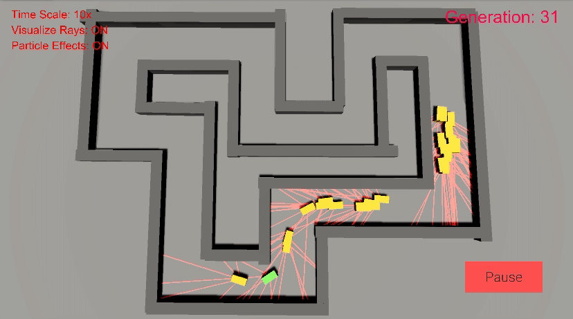

# Self-Driving-Neuroevolution

This project is a simple neuroevolution environment for self-driving cars made in Unity. In our project, each agent is composed of a fully connected neural network that takes in ray-cast data as input and returns acceleration and steering directions as output. Initially, each agent begins with randomized weights and by simulating the process of evolution through a genetic algorithm, agents learn how to drive around any track without crashing into walls. 

## Demo


## Features
* Map builder where the user can create their own track and change the spawn point of the agents
* Comes with 3 prebuilt tracks for testing
* Visualization of the ray-casts of each agent
* Adjustable time-scale to speed up / slow down the training of the agents

## How it works

In addition to the environment itself, a video series was made documenting all the theory associated with this project. For more details on how this project works, visit the playlist [here](https://www.youtube.com/playlist?list=PL9H-jTxvkHm3sYmsrsHL4xEypVPBOkK90). 

## Installation
To run the project locally:
1. Clone the repository
	``` sh
	git clone https://github.com/edweenie123/Self-Driving-Neuroevolution.git
	```
2. Open the project in Unity 2019.4.7f1 

## Team Members
* Project programmed by [Edwin Chen](https://github.com/edweenie123)
* Supplementary videos made by [Edward Song](https://github.com/edward-song-life-is-short)
